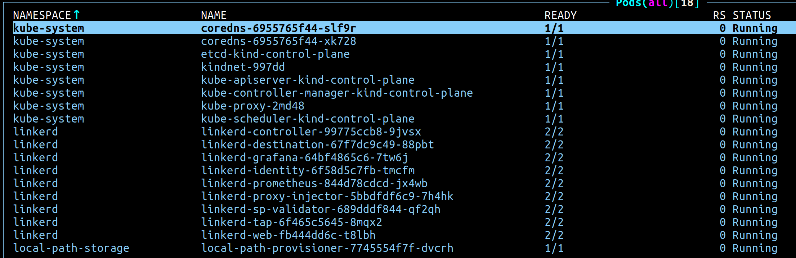
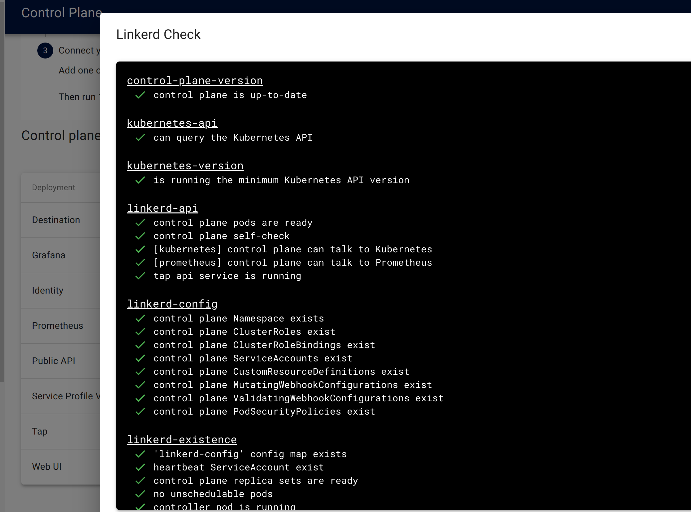

# 12Linkerd...

Installing linkerd mesh is really that simple

```
make up
```

And to destroy

```
make down
```





## Requirements

- step-cli ( To generate certs )
- helm
- docker
- K.I.N.D ( Kubernetes in docker )
